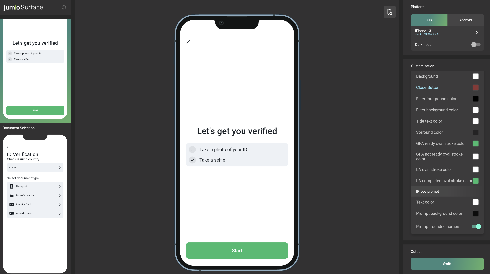

# Integration Guide for iOS SDK
Jumio’s products allow businesses to establish the genuine identity of their users by verifying government-issued IDs in real-time. ID Verification, Identity Verification and other services are used by financial service organizations and other leading brands to create trust for safe onboarding, money transfers and user authentication.

## Table of Contents
- [Release Notes](#release-notes)
- [Code Documentation](#code-documentation)
- [Setup](#setup)
  - [Dependencies](#dependencies)
    - [Via Cocoapods](#via-cocoapods)
    - [Via Carthage](#via-carthage)
    - [Manually](#manually)
  - [SDK Version Check](#sdk-version-check)
  - [Jailbreak Detection](#jailbreak-detection)
  - [Build Settings](#build-settings)
  - [NFC Setup](#nfc-setup)
  - [Digital Identity Setup](#digital-identity-setup)
  - [Risk Signal: Device Risk](#risk-signal-device-risk)
- [ML Models](#ml-models)
  - [Bundling models in the app](#bundling-models-in-the-app)
  - [Preloading models](#preloading-models)
- [Initialization](#initialization)
- [Configuration](#configuration)
  - [Workflow Selection](#workflow-selection)
  - [Transaction Identifiers](#transaction-identifiers)
  - [Preselection](#preselection)
  - [Camera Handling](#camera-handling)
- [SDK Workflow](#sdk-workflow)
  - [Initialization](#initialization)
  - [Success](#success)
  - [Error](#error)
  - [Retrieving information](#retrieving-information)
- [Default UI](#default-ui)
- [Customization](#customization)
  - [Customization Tool](#customization-tool)
  - [Default UI customization](#default-ui-customization)
  - [Custom UI customization](#custom-ui-customization)

## Release Notes
Please refer to our [Change Log](changelog.md) for more information. Current SDK version: __1.0.0__

For technical changes that should be considered when updating the SDK, please read our [Transition Guide](transition_guide.md).

## Setup
The [basic setup](../README.md#basics) is required before continuing with the following setup for the Jumio Legacy Wrapper SDK.

### Dependencies

#### Via Cocoapods
Jumio supports CocoaPods as dependency management tool for easy integration of the SDK. You are required to use **Cocoapods 1.11.0** or newer.

If you are not yet using Cocoapods in your project, first run:
```
sudo gem install cocoapods
pod init
```
Then update your local clone of the specs repo in Terminal to ensure that you are using the latest podspec files using:
```
pod repo update
```
Adapt your Podfile and add the pods according to the product(s) you want use. Check the following example how a Podfile could look like:

```
source 'https://github.com/CocoaPods/Specs.git'

platform :ios, '12.0'
use_frameworks! # Required for proper framework handling

pod 'JumioLegacyWrapper', '~>1.0.0'
```

Install the pods to your project via Terminal:
```
pod install
```

#### Via Carthage

Jumio Legacy Wrapper supports Carthage as dependency management tool for easy integration of the SDK.

Adapt you Cartfile and add Jumio dependencies. Check the following example how a Cartfile could look like:

```
#Core (always add):
binary "https://raw.githubusercontent.com/Jumio/mobile-sdk-ios-legacy/master/Carthage/JumioLegacyWrapper.json" == 1.0.0
binary "https://raw.githubusercontent.com/Jumio/mobile-sdk-ios/master/Carthage/Jumio.json" ~> 4.9.1

#Addons:
binary "https://raw.githubusercontent.com/Jumio/mobile-sdk-ios/master/Carthage/JumioIProov.json" ~> 4.9.1
binary "https://raw.githubusercontent.com/Jumio/mobile-sdk-ios/master/Carthage/IProovDependencies.json" ~> 4.9.1
binary "https://raw.githubusercontent.com/Jumio/mobile-sdk-ios/master/Carthage/JumioLiveness.json" ~> 4.9.1
binary "https://raw.githubusercontent.com/Jumio/mobile-sdk-ios/master/Carthage/JumioDatadog.json" ~> 4.9.1
binary "https://raw.githubusercontent.com/Jumio/mobile-sdk-ios/master/Carthage/JumioDefaultUI.json" ~> 4.9.1
```

Update you Carthage dependencies via Terminal:
```
carthage update --use-xcframeworks
```

### Manually
Download our frameworks manually from the fllowing two links:
* [ios-jumio-mobile-legacy-wrapper-1.0.0.zip](https://repo.mobile.jumio.ai/com/jumio/ios/jumio-mobile-legacy-wrapper/1.0.0/ios-jumio-mobile-legacy-wrapper-1.0.0.zip) 
* [ios-jumio-mobile-sdk-4.9.1.zip](https://repo.mobile.jumio.ai/com/jumio/ios/jumio-mobile-sdk/4.9.1/ios-jumio-mobile-sdk-4.9.1.zip)

__Using iProov (manually):__
* JumioIProov.xcframework
* iProov.xcframework

ℹ️&nbsp;&nbsp;__Note:__ Our sample project on GitHub contains the sample implementation without our frameworks. The project file contains a “Run Script Phase” which downloads our frameworks automatically during build time.

The Jumio Legacy Wrapper SDK consists of several dynamic frameworks. Depending on which product you use, you'll have to add the right frameworks to your project.

Please see [Strip unused frameworks](integration_faq.md#strip-unused-frameworks) for more information.

Add the following linker flags to your Xcode Build Settings:  
ℹ️&nbsp;&nbsp;__Note:__ Added automatically if using CocoaPods.
- "-lc++"
- "-ObjC" (recommended) or -all_load

Make sure that the following Xcode build settings in your app are set accordingly:

| Setting | Value |
| :--- | :---: |
| Link Frameworks Automatically | YES |

### SDK Version Check
Use `NetverifyViewController.sdkVersion()` to check which SDK version is being used.

### Jailbreak Detection
For security reasons, applications implementing the SDK should not run on jailbroken devices. Use either the below method [`isJailbrokenDevice`][isJailbrokenDevice] or a self-devised check to prevent usage of SDK scanning functionality on jailbroken devices.
```
JumioDeviceInfo.isJailbrokenDevice()
```

⚠️&nbsp;&nbsp;__Note:__ Please be aware that the JumioSDK jailbreak check uses various mechanisms for detection, but doesn't guarantee to detect 100% of all jailbroken devices.

### Build Settings
For security reasons, you should set the following build settings:
To generate a position independent executable, the build settings "Generate Position-Dependent Executable" and "Generate Position-Dependent Code" should both be set to "No".
For Objective-C projects, you should enable stack canaries by adding "-fstack-protector-all" to "Other C Flags".
For Objective-C projects, you should set "Objective-C Automatic Reference Counting" to "Yes".

### NFC Setup
To make our SDK capable of reading NFC chips you will need to set the following settings:

Add the Near Field Communication Tag Reading capability to your project, App ID and provisioning profiles in [Apple Developer portal](https://developer.apple.com).
Add `NFCReaderUsageDescription` to your __info.plist__ file with a proper description of why you are using this feature. You will also need to add the following key and value to your plist file to be able to read NFC chips from passports:
```
<key>com.apple.developer.nfc.readersession.iso7816.select-identifiers</key>
<array>
    <string>A0000002471001</string>
</array>
```

### Digital Identity Setup
Over the course of Digital Identity verification the SDK will launch an according third party application representing your Digital Identity.
Communication between both applications (your integrating application and the Digital Identity application) is done via a so-called "deep link".

#### Deep link setup
To enable your app specific deep link, our support team has to setup an according scheme of your choice for you. This scheme will be used by the SDK to identify your application while returning from the Digital Identity provider's application. For the scheme basically any string can be used, however it is recommended that it is unique to your application in some way.

Following snippet shows how the deep link needs to be setup in your application's `AppDelegate.swift` file:
```swift
func application(_ app: UIApplication, open url: URL, options: [UIApplication.OpenURLOptionsKey : Any]) -> Bool{
    guard Jumio.SDK.handleDeeplinkURL(url) else {
        return false
    }
    return true
}
```

### Risk Signal: Device Risk
If you want to include risk signals into your application, please check our [Risk Signal guide](https://docs.jumio.com/production/Content/References/Risk%20Signals/Device%20Risk.htm).

#### Iovation setup
To integrate the device risk vendor Iovation into your application, please follow the [Iovation integration guide](https://github.com/iovation/deviceprint-SDK-iOS).

#### API call
To provide Jumio with the generated Device Risk blackbox, please follow the [Device Risk API guide](https://docs.jumio.com/production/Content/Integration/Integration%20Channels/REST%20APIs.htm).

----

## ML Models

By default, required models get downloaded by the SDK if not provided via the bundle or preloaded.

### Bundling models in the app
You can download our encrypted models and add them to your bundle for the following frameworks.

⚠️&nbsp;&nbsp;__Note:__ Make sure not to alter the downloaded models (name or content) before adding them to your bundle.

#### DocFinder
If you are using Docfinder, find the required models [here](https://cdn.mobile.jumio.ai/ios/model/coreml_classifier_on_device_ep_29_float16_quant.enc) and [here](https://cdn.mobile.jumio.ai/ios/model/docfinderModel_121923.enc).

#### Liveness
If you are using JumioLiveness.xcframework, find the required models [here](https://cdn.mobile.jumio.ai/ios/model/liveness_sdk_assets_v_0_0_1.enc).

### Preloading models
To preload models use [`Jumio.Preloader`][jumioPreloader]jumioPreloader. It provides functionality to preload models without the JumioSDK being initialized. To do so call:

```swift
Jumio.Preloader.shared.preloadIfNeeded()
```

The [`Jumio.Preloader`][jumioPreloader] will identify which models are required based on your configuration.

Preloaded models are cached so they will not be downloaded again. To clean the models call:

```swift
Jumio.Preloader.clean()
```
⚠️&nbsp;&nbsp;__Note:__ `clean` should never be called while the SDK is running.

To get notified that preloading has finished, you can implement the [`Jumio.Preloader.Delegate`][jumioPreloaderDelegate] methods and set the delegate as follows:

```swift
Jumio.Preloader.shared.delegate = {your delegate}
```

----

## Initialization
Your OAuth2 credentials are constructed using your previous API token as the Client ID and your previous API secret as the Client secret. You can view and manage your Client ID and secret in the Customer Portal under:
* __Settings > API credentials > OAuth2 Clients__

Client ID and Client secret are used to generate an OAuth2 access token. OAuth2 has to be activated for your account. Contact your Jumio Account Manager for activation. Send a workflow request using the acquired OAuth2 access token to receive the SDK token necessary to initialize the Jumio SDK. For more details, please refer to [Authentication and Encryption](../README.md#authentication-and-encryption).

```
let config = NetverifyConfiguration()
config.authorizationToken = "YOUR_SDK_TOKEN"
config.dataCenter = jumioDataCenter
```

Make sure that your SDK token is correct. If it isn't, an exception will be thrown. Then provide a reference to identify the scans in your reports (max. 100 characters or `null`). Data center is set to `.JumioDataCenterUS` by default. If your customer account is in the EU data center, use `.JumioDataCenterEU` instead. Alternatively, use `.JumioDataCenterSG` for Singapore.

⚠️&nbsp;&nbsp;__Note:__ We strongly recommend storing all credentials outside of your app! We suggest loading them during runtime from your server-side implementation.
⚠️&nbsp;&nbsp;__Note:__ If the wrapper is initialized via `apiToken`/`apiSecret` then bundle ID and version of the hosting app will be send to Jumio.

Make sure initialization and presentation are timely within one minute. On iPads, the presentation style `UIModalPresentationFormSheet` is default and mandatory.
```
self.present(netverifyVC, animated: true, completion: nil)
```

## Configuration
Every Jumio Legacy Wrapper SDK instance is initialized using a specific [`sdk.authorizationToken`][authorizationToken]. This token contains information about the workflow, credentials, transaction identifiers and other parameters. Configuration of this token allows you to provide your own internal tracking information for the user and their transaction, specify what user information is captured and by which method, as well as preset options to enhance the user journey. Values configured within the [`sdk.authorizationToken`][authorizationToken] during your API request will override any corresponding settings configured in the Customer Portal.

### Workflow Selection
Use ID verification callback to receive a verification status and verified data positions (see [Callback section](https://jumio.github.io/kyx/integration-guide.html#callback)). Please note: The Jumio Legacy SDK Wrapper will invoke a new calback and retrieval format compared to the Netverify SDK 3.9.x - to use the old format please contact Jumio Support. Make sure that your customer account is enabled to use this feature. A callback URL can be specified for individual transactions (for URL constraints see chapter [Callback URL](https://jumio.github.io/kyx/integration-guide.html#jumio-callback-ip-addresses)). This setting overrides any callback URL you have set in the Jumio Customer Portal. Your callback URL must not contain sensitive data like PII (Personally Identifiable Information) or account login. Your callback URL must not contain sensitive data like PII (Personally Identifiable Information) or account login. Set your callback URL using the `callbackUrl` parameter.

Use the correct [workflow definition key](https://docs.jumio.com/production/Content/References/Workflows/Standard%20Services.htm) in order to request a specific workflow. Set your key using the `workflowDefinition.key` parameter.

```
'{
  "customerInternalReference": "CUSTOMER_REFERENCE",
  "workflowDefinition": {
    "key": X,
  },
  "callbackUrl": "YOUR_CALLBACK_URL"
}'
```

For more details, please refer to our [Workflow Description Guide](https://support.jumio.com/hc/en-us/articles/4408958923803-KYX-Workflows-User-Guide).

Identity Verification has to be activated for your account. If you use Identity Verification, make sure the necessary frameworks are linked to your app project:
* `iProov.xcframework`

ℹ️&nbsp;&nbsp;__Note:__ Identity Verification requires portrait orientation in your app.

### Transaction Identifiers
There are several options in order to uniquely identify specific transactions. `customerInternalReference` allows you to specify your own unique identifier for a certain scan (max. 100 characters). Use `reportingCriteria`, to identify the scan in your reports (max. 100 characters). You can also set a unique identifier for each user using `userReference` (max. 100 characters).

For more details, please refer to __Request Body__ section in our [KYX Guide](https://docs.jumio.com/production/Content/References/Workflows/IDIV/Account%20Creation%20or%20Update.htm).

```
'{
  "customerInternalReference": "CUSTOMER_REFERENCE",
  "workflowDefinition": {
    "key": X,
  },
  "reportingCriteria": "YOUR_REPORTING_CRITERIA",
  "userReference": "YOUR_USER_REFERENCE"
}'
```

⚠️&nbsp;&nbsp;__Note:__ Transaction identifiers must not contain sensitive data like PII (Personally Identifiable Information) or account login.

### Preselection
You can specify issuing country using [ISO 3166-1 alpha-3](https://en.wikipedia.org/wiki/ISO_3166-1_alpha-3) country codes, as well as ID types to skip selection during the scanning process. In the example down below, Austria ("AUT") and the USA ("USA") have been preselected. PASSPORT and DRIVER_LICENSE have been chosen as preselected document types. If all parameters are preselected and valid and there is only one given combination (one country and one document type), the document selection screen in the SDK can be skipped entirely.

⚠️&nbsp;&nbsp;__Note:__ "Digital Identity" document type can not be preselected!

For more details, please refer to __Request Body__ section in our [KYX Guide](https://docs.jumio.com/production/Content/References/Workflows/IDIV/Account%20Creation%20or%20Update.htm).
```
'{
  "customerInternalReference": "CUSTOMER_REFERENCE",
  "workflowDefinition": {
    "key": X,
    "credentials": [
      {
        "category": "ID",
        "type": {
          "values": ["DRIVING_LICENSE", "PASSPORT"]
        },
        "country": {
          "values": ["AUT", "USA"]
        }
      }
    ]
  }
}'
```

## SDK Workflow
Implement the delegate methods of the [`NetverifyViewControllerDelegate`]() protocol to be notified of successful initialization, successful scans, and errors. Dismiss the [`NetverifyViewController`][NetverifyViewController] instance in your app in case of success or error.

### Initialization
When this method is fired, the SDK has finished initialization and loading tasks, and is ready to use. The error object is only set when an error has occurred (e.g. wrong credentials are set or a network error occurred).
```
let config = NetverifyConfiguration()
let netverifyViewController = NetverifyViewController(configuration: config)
```

### Success
Upon success, the extracted document data is returned, including its scan reference.
```swift
func netverifyViewController(_ netverifyViewController: NetverifyViewController, didFinishWith documentData: NetverifyDocumentData, scanReference: String) {
    let scanReference: String = scanReference
}
```

### Error
This method is fired when the user presses the cancel button during the workflow or in an error situation. The parameter `error` contains an error code and a message. The corresponding scan reference is also available.
```swift
func netverifyViewController(_ netverifyViewController: NetverifyViewController, didCancelWithError error: NetverifyError?, scanReference: String?) {
    let errorCode: String = error.code
    let errorMessage: String = error.message
}
```

### Cleanup
After the SDK was dismissed and especially if you want to create a new instance of NetverifyViewController make sure to call [`destroy`](https://jumio.github.io/mobile-sdk-ios/Netverify/Classes/NetverifyViewController.html#/c:objc(cs)NetverifyViewController(im)destroy) to ensure proper cleanup of the SDK.
```swift
self.dismiss(animated: true) {
    self.netverifyViewController?.destroy()
    self.netverifyViewController = nil
}
```

### Retrieving information
The following tables give information on the specification of all data parameters and errors:

#### Class ___NetverifyDocumentData___
| Parameter | Type | Max. length | Description  |
|:-------------------|:-----------  |:-------------|:-----------------|
| selectedCountry | NSString| 3| [ISO 3166-1 alpha-3](https://en.wikipedia.org/wiki/ISO_3166-1_alpha-3) country code as provided or selected (deprecated) |
| selectedDocumentType | NetverifyDocumentType | | Passport, DriverLicense, IdentityCard and Visa (deprecated)|
| idNumber | NSString | 100 | Identification number of the document |
| personalNumber | NSString | 14| Personal number of the document|
| issuingDate | NSDate | | Date of issue |
| expiryDate | NSDate | | Date of expiry |
| issuingCountry | NSString | 3 | Country of issue as [ISO 3166-1 alpha-3](https://en.wikipedia.org/wiki/ISO_3166-1_alpha-3) country code |
| lastName | NSString | 100 | Last name of the customer|
| firstName | NSString | 100 | First name of the customer|
| dob | NSDate | | Date of birth |
| gender | NetverifyGender | | Gender M, F, or X |
| originatingCountry | NSString | 3|Country of origin as [ISO 3166-1 alpha-3](https://en.wikipedia.org/wiki/ISO_3166-1_alpha-3) country code |
| addressLine | NSString | 64 | Street name |
|subdivision| NSString| 3|  Last three characters of [ISO 3166-2:US](https://en.wikipedia.org/wiki/ISO_3166-2:US) or [ISO 3166-2:CA](https://en.wikipedia.org/wiki/ISO_3166-2:CA) subdivision code  |
| postCode | NSString | 15 | Postal code |
| mrzData |  NetverifyMrzData | | MRZ data, see table below |
| optionalData1 | NSString | 50 | Optional field of MRZ line 1 |
| optionalData2 | NSString | 50 | Optional field of MRZ line 2 |
| placeOfBirth | NSString | 255 | Place of birth |
| extractionMethod | NetverifyExtractionMethod | | Extraction method used during scanning (MRZ, OCR, BARCODE, BARCODE_OCR or NONE) |
| frontImage | UIImage | | Raw image data within an UIImage for front in case this is enabled by your Account Manager  |
| backImage | UIImage | | Raw image data within an UIImage for back in case this is enabled by your Account Manager |
| faceImage | UIImage | | Raw image data within an UIImage for face in case this is enabled by your Account Manager |

#### Class ___NetverifyMrzData___
| Parameter |Type | Max. length | Description |
|:---------------|:------------- |:-------------|:-----------------|
| format | NetverifyMRZFormat | |
| line1 | NSString | 50 | MRZ line 1 |
| line2 | NSString | 50 | MRZ line 2 |
| line3 | NSString | 50| MRZ line 3 |
| idNumberValid | BOOL| | True if ID number check digit is valid, otherwise false |
| dobValid | BOOL | | True if date of birth check digit is valid, otherwise false |
| expiryDateValid | BOOL| | True if date of expiry check digit is valid or not available, otherwise false|
| personalNumberValid | BOOL | | True if personal number check digit is valid or not available, otherwise false |
| compositeValid | BOOL | | True if composite check digit is valid, otherwise false |

#### Error Codes
List of all **_error codes_** that are available via the `code` and `message` property of the [`NetverifyError`] object. The first letter (A-Z) represents the error case. The remaining characters are represented by numbers that contain information helping us understand the problem situation ([xx][yyyy]).

| Code | Message  | Description |
| :----------------------------: |:-------------|:-----------------|
| A[xx][yyyy]| We have encountered a network communication problem | Retry possible, user decided to cancel |
| B[xx][yyyy]| Authentication failed | Secure connection could not be established, retry impossible |
| C[xx]0401 | Authentication failed | API credentials invalid, retry impossible |
| E[xx]0000 | No Internet connection available | Retry possible, user decided to cancel |
| F000000 | Scanning not available at this time, please contact the app vendor | Resources cannot be loaded, retry impossible |
| G000000 | Cancelled by end-user | No error occurred |
| H000000 | The camera is currently not available | Camera cannot be initialized, retry impossible |
| I000000 | Certificate not valid anymore. Please update your application | End-to-end encryption key not valid anymore, retry impossible |
| J000000 | Transaction already finished | User did not complete SDK journey within session lifetime |
| N000000 | Scanning not available at this time, please contact the app vendor | Required images are missing to finalize the acquisition |
| Y000000 | The barcode of your document didn't contain your address, turn your document and scan the front. | __Only Custom UI:__ Scanned Barcode (e.g. US Driver License) does not contain address information. Show hint and/or call `retryAfterError` |
| Z000000 | You recently scanned the front of your document. Please flip your document and scan the back. | __Only Custom UI:__ Backside of the document was scanned but most likely the frontside of the document was detected. Show hint and/or call `retryAfterError` |

⚠️&nbsp;&nbsp;__Note:__ Please always include the whole error code when filing an error related issue to our support team.


## Customization
### Customization Tool
[Jumio Surface](https://jumio.github.io/surface-tool) is a web tool that offers the possibility to apply and visualize, in real-time, all available customization options for the Jumio SDK, as well as an export feature to import the applied changes straight into your codebase.

[](https://jumio.github.io/surface-tool)

### Default UI customization
The surface tool utilizes each screen of Jumio's [Default UI](#default-ui) to visualize all items and colors that can be customized. If you are planning to use the [Default UI](#default-ui) implementation, you can create a [`Jumio.Theme`] instance and set it in the configuration object. Example configuring theme with Netverify:

```
let theme = Jumio.Theme()

let config = NetverifyConfiguration()
config.theme = theme
```

After customizing the SDK via the surface tool, you can click the `Swift` button in the __Output__ menu on the bottom right to copy the code from the theme [`Jumio.Theme`] to your iOS app's.

You can customize Jumio SDK UI. By using [`Jumio.Theme`] class you can create your own theme and set it to your Jumio instance.

#### Dark Mode
[`Jumio.Theme`] attributes can also be customized for dark mode. For each [`Jumio.Theme.Value`][jumioThemeValue] you can initiate with either only one color or with `light and dark`. If `light and dark` colors have been specified, they will be applied to the modes respectively.
Dark mode will be applied when darkmode is enabled in system settings.

----

# Security
All SDK related traffic is sent over HTTPS using TLS and public key pinning. Additionally, the information itself within the transmission is also encrypted utilizing __Application Layer Encryption__ (ALE). ALE is a Jumio custom-designed security protocol that utilizes RSA-OAEP and AES-256 to ensure that the data cannot be read or manipulated even if the traffic was captured.

# Support

## Licenses
The software contains third-party open source software. For more information, see [licenses](#licenses).

This software is based in part on the work of the Independent JPEG Group.

## Contact
If you have any questions regarding our implementation guide please contact Jumio Customer Service at support@jumio.com. The [Jumio online helpdesk](https://support.jumio.com) contains a wealth of information regarding our services including demo videos, product descriptions, FAQs, and other resources that can help to get you started with Jumio.

## Copyright
&copy; Jumio Corporation, 395 Page Mill Road, Suite 150, Palo Alto, CA 94306

The source code and software available on this website (“Software”) is provided by Jumio Corp. or its affiliated group companies (“Jumio”) "as is” and any express or implied warranties, including, but not limited to, the implied warranties of merchantability and fitness for a particular purpose are disclaimed. In no event shall Jumio be liable for any direct, indirect, incidental, special, exemplary, or consequential damages (including but not limited to procurement of substitute goods or services, loss of use, data, profits, or business interruption) however caused and on any theory of liability, whether in contract, strict liability, or tort (including negligence or otherwise) arising in any way out of the use of this Software, even if advised of the possibility of such damage.

In any case, your use of this Software is subject to the terms and conditions that apply to your contractual relationship with Jumio. As regards Jumio’s privacy practices, please see our privacy notice available here: [Privacy Policy](https://www.jumio.com/legal-information/privacy-policy/).